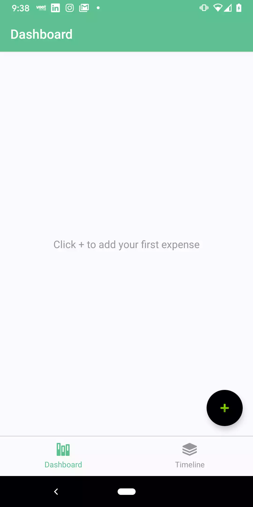
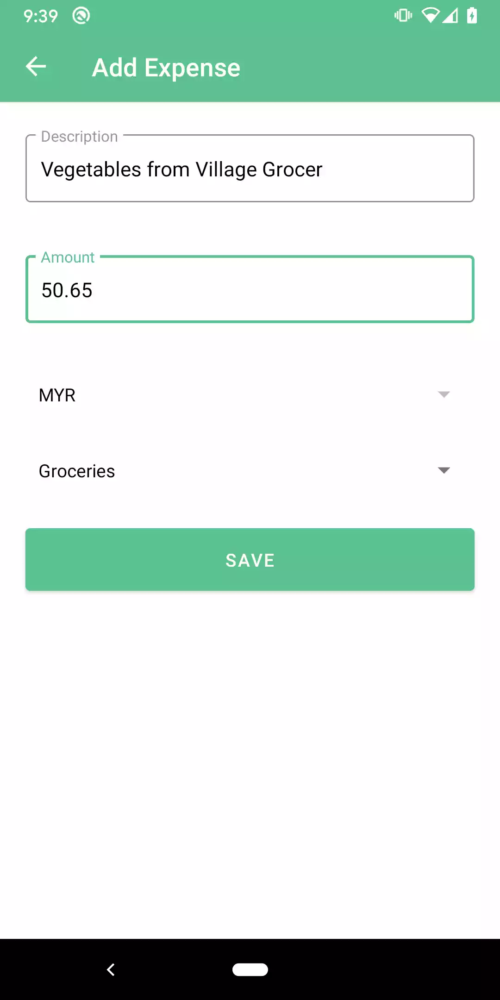
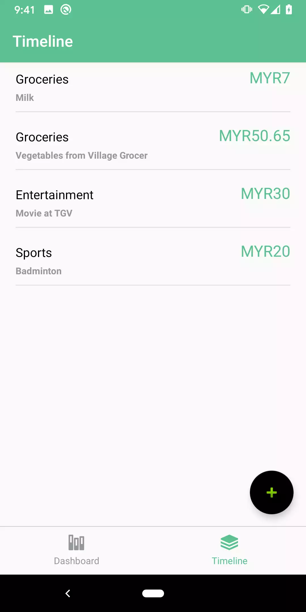

# Expense Tracker

Simple application to track daily expenses

## Getting Started

1. Clone the project 
```
git clone https://github.com/mindvalley/Mobile_Android_MVA.git
```
2. Open the project in supporting IDE - Android Studio or Intellij

### Prerequisites

1. Stable version of Android Studio. App uses version 3.6.3
2. Gradle 5.6.4 or above
3. If Android studio is outdated > click on Android Studio > Check for updates
4. Make sure adb is installed. adb is included in the Android SDK Platform-Tools package. You can download this package with the SDK Manager, which installs it at android_sdk/platform-tools/. If it is not installed install it via brew
```
brew cask install android-platform-tools
```

### Installing

1. Use the command to build the project
```
./gradlew assembleDebug
```
2. Connect your Android device via USB on your machine. Make sure to enable USB Debugging Developers Options from settings.
Follow [this] (https://developer.android.com/studio/debug/dev-options) to enable developer options
3. Once the project is build successfully, go to your adb installation path and type
```
./adb devices
```
You should be able to see the connected device

4. Run
```
./adb install {local path to your project}/ExpenseTracker/app/build/outputs/apk/debug/app-debug.apk
```
Apk will be installed on the attached device. Alternative you can also install the apk from IDE.

## Running the tests

1. Open terminal from Android Studio and navigate to project path.
2. Run the unit tests using the command  
```
./gradlew test
```
3. Alternatively you can run tests from IDE.

### Break down into end to end tests

Instrument tests include testing Room Database.
Run the tests using command
```
./gradlew connectedAndroidTest
```
Alternatively you can run the tests from IDE.


### And coding style tests

This project is based on clean architecture principals with MVVM
It has following layers :

1. **Data Layer**
This layer contains network call and database operations

2. **Domain Layer**
This layer contains business logic

3. **Presentation Layer**
This layer is responsible for showing the view. ViewModel acts as a connection between presentation layer and inner layers (domain and data).

Using this coding style we can use both declarive and imperative programming concepts.

## Screenshots




* Clean architecture by Uncle Bob
* [Jetpack](https://developer.android.com/jetpack/docs/guide)

## Authors

* **Harsh Mittal**

